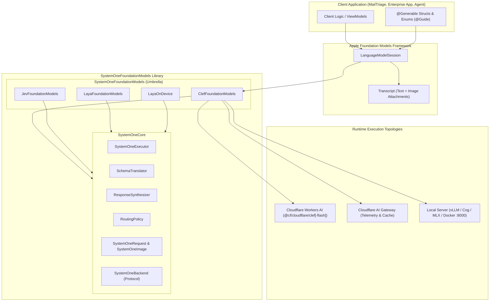
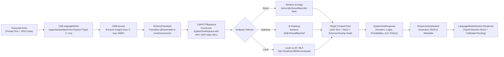
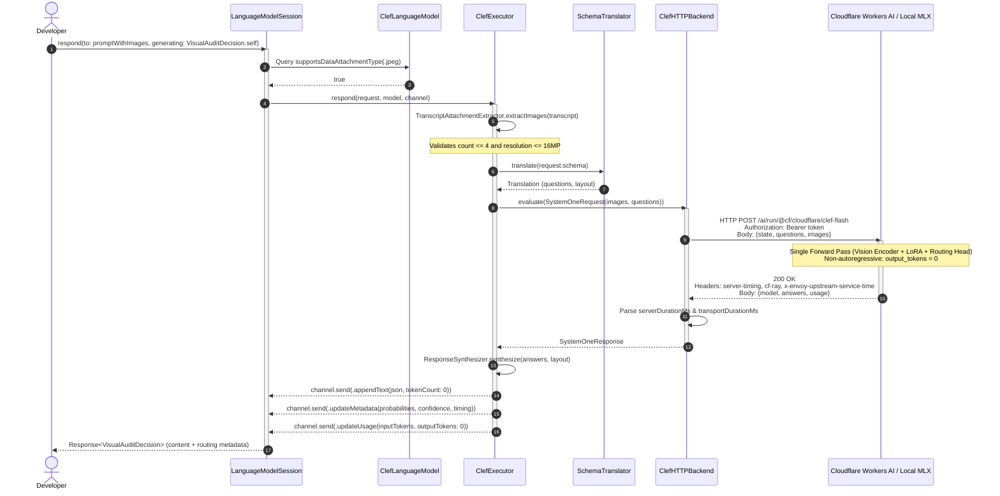

# ADR-2026-10-03-01: Cloudflare Clef & Clef-Flash Multimodal Decision Model Integration

- **Status**: Proposed
- **Date**: 2026-10-03
- **Author**: Senior Architect Agent
- **PRD Reference**: `docs/prd/PRD-2026-10-03-clef-decision-models.md`
- **Target Modules**: `SystemOneCore`, `ClefFoundationModels`, `SystemOneFoundationModels`
- **Target Release**: SystemOneFoundationModels 1.2.0 (iOS 27.0+, macOS 27.0+, visionOS 27.0+)

---

## 1. Context & Problem Statement

Client applications and autonomous agents on Apple platforms are increasingly multimodal. Everyday operational tasks require evaluating visual evidence alongside textual context:
- Inspecting damaged parcels, return merchandise, and receipt line items.
- Verifying KYC identity documents and user-submitted forms.
- Assessing screen state, interactive UI elements, and accessibility barriers in autonomous workflow runners.
- Moderating user-generated media and routing visual customer tickets.

### The Generative Vision-Language Dilemma
When developers implement visual classification using standard autoregressive generative models (e.g., GPT-4o, Claude 3.5 Sonnet, Gemini 1.5 Pro, or Llama 3.2 Vision), they encounter severe architectural handicaps:
1. **Autoregressive Latency Penalties**: Decoding markdown, prose descriptions, or structured JSON strings token-by-token introduces 1,200ms to 3,500ms of end-to-end latency. This prohibits sub-second transactional classification and degrades interactive mobile experiences.
2. **Uncalibrated Hallucinated Confidence**: Generative decoders emit tokens according to next-token probability distributions, not calibrated Bayesian probabilities for propositions. Models hallucinate self-reported confidence or require secondary prompting passes, compromising automated workflows.
3. **Severe Token Overhead**: High-resolution image patching generates hundreds to thousands of vision tokens per evaluation, inflating operational cloud spend for high-throughput batch workloads.
4. **Cloud Monoculture & Privacy Constraints**: Frontier vision models are predominantly closed cloud services. Developers cannot run them on local developer workstations, zero-egress corporate clouds, or edge worker environments.

### The Clef Breakthrough: System One Multimodality
Cloudflare has released **Clef** (27B, based on Qwen3.8) and **Clef-Flash** (9B, based on Qwen3.5)—the first dedicated multimodal decision models in the System One ecosystem. Rather than autoregressively generating text:
- Clef couples high-resolution multimodal vision transformers with rank-256 Low-Rank Adaptation (LoRA) and a specialized **joint schema routing head**.
- Clef evaluates contextual text and up to 4 high-resolution images ($\le 16\text{MP}$ each) in a **single forward pass**.
- Clef emits zero autoregressive content tokens (`output_tokens: 0`), computing calibrated decision primitives directly:
  - **`noul`**: Bayesian probability of truth ($0.0 \dots 1.0$) for boolean assertions.
  - **`choice`**: Discrete categorical classification across candidate options.
  - **`score`**: Bounded ordinal rubric scoring across numeric levels.

### The Architectural Challenge
`SystemOneFoundationModels` must integrate Cloudflare Clef and Clef-Flash into Apple's native **Foundation Models** framework (`LanguageModel`, `LanguageModelSession`, `@Generable`, `@Guide`) such that:
1. Developers evaluate multimodal `@Generable` schemas using Apple's canonical `LanguageModelSession.respond(to:generating:)` API with native `Transcript` image attachments and zero vendor-specific wrapper abstractions.
2. `SystemOneCore` gains clean, extensible multimodal payload DTOs without breaking existing text-only backends (Laya on-device Core ML, local `laya-serve`, TypeSafe Jev Cloud).
3. The networking layer supports direct Cloudflare Workers AI edge endpoints, Cloudflare AI Gateway (with caching and telemetry), and self-hosted local inference runners (`localhost:8000` vLLM / Cog / MLX / Docker Model Runner).
4. Strict Swift 6 concurrency, zero third-party dependencies, Swift 6.1 Package Traits, and deterministic offline unit testing are strictly preserved.

---

## 2. Considered Options

### Architectural Decision Area 1: Multimodal Data Ingestion & Attachment Representation (`SystemOneCore`)
- **Option 1A: Out-of-Band Image Arrays on Custom Session Wrapper**:
  - *Description*: Create a custom `ClefSession` class exposing `respond(to:images:generating:)`.
  - *Pros*: Simple to implement; does not touch core Foundation Models protocols.
  - *Cons*: Violates workspace core principles (Directive 1 & 7). Developers must learn a proprietary session type instead of Apple's standard `LanguageModelSession`. Disables interoperability with Apple Intelligence LLMs and mock harnesses.
- **Option 1B: Inline String Formatting / Markdown Data URLs in Text Prompt**:
  - *Description*: Instruct developers to embed base64 Data URLs directly into the textual prompt string (`"Check this image: data:image/jpeg;base64,..."`).
  - *Pros*: Requires zero modifications to `SystemOneRequest` or executor protocols.
  - *Cons*: Highly fragile; risks escaping errors; pollutes text tokens; prevents the model backend from distinguishing text context from structured visual tensors; violates Apple Foundation Models attachment standards.
- **Option 1C: Native Apple Foundation Models `Transcript` Attachment Ingestion with Strongly-Typed `SystemOneImage` DTO [Chosen]**:
  - *Description*: Update `SystemOneRequest` in `SystemOneCore` with an optional `images: [SystemOneImage]?` payload. Update `SystemOneExecutor` to parse `Transcript` entries, extracting data segments conforming to supported image `UTType`s (`public.png`, `public.jpeg`, `org.webmproject.webp`). Support structured encoding (`data:image/{format};base64,...` Data URLs and structured JSON image objects).
  - *Pros*: 100% Apple-native ergonomics; caller passes `Transcript.Segment.image(...)` or standard `LanguageModelSession` attachments; typed validation occurs before network dispatch; backwards-compatible with text-only requests.
  - *Cons*: Requires updating `SystemOneRequest` serialization and adding image segment extraction logic to `SystemOneExecutor`.

### Architectural Decision Area 2: Backend Architecture & Endpoint Topology (`ClefHTTPBackend`)
- **Option 2A: Multiple Disjoint Backend Structs (`WorkersAIBackend`, `AIGatewayBackend`, `LocalBackend`)**:
  - *Description*: Implement separate backend structs for each hosting environment.
  - *Pros*: Isolated codebase per environment.
  - *Cons*: Massive code duplication for HTTP transport, JSON decoding, server-timing header parsing, and error mapping; fragmented configuration surface.
- **Option 2B: Unified Configurable `ClefHTTPBackend` with Typed `ClefEndpoint` Enum [Chosen]**:
  - *Description*: Implement a single `ClefHTTPBackend` conforming to `SystemOneBackend`. Back it with a strongly-typed, hashable `ClefEndpoint` enum:
    - `.workersAI(accountID:apiToken:model:)`: Direct Cloudflare Workers AI edge REST endpoint (`https://api.cloudflare.com/client/v4/accounts/{account_id}/ai/run/@cf/cloudflare/{model}`).
    - `.aiGateway(accountID:gatewayID:apiToken:model:)`: Cloudflare AI Gateway endpoint (`https://gateway.ai.cloudflare.com/v1/{account_id}/{gateway_id}/workers-ai/@cf/cloudflare/{model}`) with telemetry and caching headers.
    - `.local(url:apiKey:model:)`: Local or self-hosted HTTP endpoints (`http://localhost:8000/v1/evaluate` or `http://localhost:8080/v1` for vLLM, Cog, Docker Model Runner, or MLX).
  - *Pros*: Single, battle-tested transport pipeline; uniform retry and latency telemetry; effortless migration from local development to production edge deployment.
  - *Cons*: Endpoint enum must encapsulate diverse URL paths and authentication schemes.

### Architectural Decision Area 3: Foundation Models Conformance & Capability Exposure (`ClefLanguageModel`)
- **Option 3A: Standalone Model Type Unrelated to `SystemOneLanguageModel`**:
  - *Description*: Create `ClefLanguageModel` with an entirely separate executor and synthesis pipeline.
  - *Pros*: Complete isolation from `SystemOneCore`.
  - *Cons*: Re-implements schema translation (`SchemaTranslator`), dual-signal synthesis (`ResponseSynthesizer`), metadata emission, and token accounting; creates divergent bug fixes.
- **Option 3B: Compositional `ClefLanguageModel` Conforming to `LanguageModel` with Native Attachment Query [Chosen]**:
  - *Description*: `ClefLanguageModel` conforms to `LanguageModel`, providing a custom `ClefExecutor` that delegates schema translation and response synthesis to `SystemOneExecutor`, while handling image attachment validation and guardrails. Declares `supportsDataAttachmentType(_ type: UTType)` returning `true` for `UTType.png`, `UTType.jpeg`, and `UTType.webP`.
  - *Pros*: Preserves DRY principles; leverages existing `SystemOneExecutor` pipeline; accurately reports multimodal capabilities to Apple Foundation Models runtime; provides specialized Clef configuration options.
  - *Cons*: Requires `SystemOneExecutor` to support multimodal requests polymorphically.

### Architectural Decision Area 4: Package Architecture & Trait Configuration (`Package.swift`)
- **Option 4A: Monolithic Bundling into `SystemOneCore`**:
  - *Description*: Place all Clef code into `SystemOneCore`.
  - *Pros*: Single module to import.
  - *Cons*: Forces image-handling logic and Cloudflare-specific endpoint logic on consumers who only need local Core ML Laya models.
- **Option 4B: Dedicated `ClefFoundationModels` Target with Swift 6.1 Package Traits [Chosen]**:
  - *Description*: 
    1. Create a dedicated target `ClefFoundationModels` depending on `SystemOneCore`.
    2. Expose a library product `ClefFoundationModels`.
    3. Include `ClefFoundationModels` in the umbrella library `SystemOneFoundationModels`.
    4. Introduce package trait `.trait(name: "Clef", description: "Enables Cloudflare Clef and Clef-Flash multimodal decision models")`.
    5. Update `.trait(name: "Remote")` to bundle `["Jev", "LayaServe", "Clef"]`.
    6. Update `.trait(name: "All")` to bundle `["Jev", "Laya", "LayaServe", "Clef"]`.
  - *Pros*: Zero binary bloat for on-device Core ML users; granular dependency control; follows modern Swift Evolution SE-0402 trait architecture established in tech-note 0009.
  - *Cons*: Adds one new target and trait definition in `Package.swift`.

### Architectural Decision Area 5: Latency Telemetry, Zero-Token Semantics & Network Resilience
- **Option 5A: Basic URLSession with No Telemetry Extraction**:
  - *Description*: Perform basic network requests and report total clock elapsed time.
  - *Pros*: Minimal code.
  - *Cons*: Cannot distinguish between client radio transit, edge routing, cold-starts, and pure model forward pass; loses valuable Cloudflare diagnostic headers (`cf-ray`, `server-timing`, `x-envoy-upstream-service-time`).
- **Option 5B: Comprehensive Telemetry Extraction, Zero-Token Accounting & Adaptive `RetryPolicy` [Chosen]**:
  - *Description*:
    1. Enforce zero generated output tokens (`output_tokens: 0`) in usage accounting since Clef executes a non-autoregressive forward pass.
    2. Extract multi-tiered server timing metrics:
       - Cloudflare Ray ID (`cf-ray`) for distributed tracing and edge support correlation.
       - RFC 7668 `server-timing` headers (e.g., `cfL4;dur=12`, `inference;dur=45`).
       - Envoy upstream time (`x-envoy-upstream-service-time`).
    3. Integrate `RetryPolicy` with exponential backoff and jitter to safely handle Cloudflare rate limits (HTTP 429), gateway cold-start timeouts (HTTP 504 / 524), and transient edge overloads (HTTP 529), respecting RFC 9110 `Retry-After`.
  - *Pros*: Production-grade observability; reliable operations across fluctuating cellular networks; transparent differentiation of edge vs server inference duration.
  - *Cons*: Requires robust header parsing logic.

---

## 3. Decision Outcome

**Chosen Architecture**: The package adopts **Option 1C**, **Option 2B**, **Option 3B**, **Option 4B**, and **Option 5B**.

### Rationale
This architecture integrates Cloudflare Clef and Clef-Flash into Apple's Foundation Models ecosystem with first-class ergonomics, mathematical confidence guarantees, zero third-party dependencies, and maximum infrastructure flexibility. Developers can prototype locally against Docker or MLX servers on Apple Silicon workstations, then deploy to Cloudflare Workers AI edge networks with zero code modifications beyond an endpoint swap.

### Positive Consequences
1. **Canonical Apple Ergonomics**: Multimodal visual decision-making works directly through `LanguageModelSession.respond(to:generating:)` using standard `@Generable` schemas and `UTType` attachments.
2. **Sub-Second Decision Latency**: By leveraging Clef's non-autoregressive joint schema routing head, decisions execute in a single forward pass without token streaming delays ($<90\text{ms}$ on Workers AI for Clef-Flash; sub-$60\text{ms}$ on local Apple Silicon M4 Max).
3. **Calibrated Visual Confidence**: Output decisions plug seamlessly into `RoutingPolicy` from `SystemOneCore`, enabling autonomous execution for high-confidence decisions ($\ge 0.85$) and safe escalation for blurry, ambiguous, or out-of-distribution images.
4. **Zero Client Runtime Dependencies**: Pure Swift standard library, `Foundation`, `UniformTypeIdentifiers`, and `FoundationModels`. Zero Alamofire, zero third-party base64 packages.
5. **Flexible Deployment Surface**: Seamlessly supports Cloudflare Workers AI, Cloudflare AI Gateway, and private local servers (vLLM, Cog, MLX, Docker Model Runner).
6. **Deterministic Offline Testing**: Fully testable offline via `MockClefBackend` in hermetic CI environments without API keys.

### Negative Consequences / Trade-offs
1. **Payload Serialization Footprint**: Encoding up to 4 high-resolution images as base64 strings increases request body size by ~33% over raw binary, requiring conscious memory management in client applications.
2. **Fixed Attachment Limits**: Requests are bounded by Clef model architecture limits ($\le 4$ images and $\le 16$ Megapixels per image); client-side guardrails must enforce these constraints prior to transmission.
3. **No Direct On-Device Core ML Weights Yet**: Unlike Laya (which bundles on-device Core ML weights for ANE), Clef 9B/27B local execution on Apple Silicon relies on local HTTP inference runtimes (e.g., MLX server, Docker) rather than embedded Core ML bundles.

---

## 4. Technical Architecture Specifications

### 4.1 Multimodal Core DTO & Attachment Pipeline (`SystemOneCore`)

`SystemOneRequest` in `SystemOneCore` is extended with an optional array of strongly-typed image payloads, preserving backward compatibility with text-only System One backends:

```swift
import Foundation

// MARK: - System One Multimodal Request DTO

/// A strongly-typed image payload attached to a System One multimodal evaluation request.
public struct SystemOneImage: Codable, Sendable, Equatable {
    /// Format specification of the serialized image.
    public enum Format: String, Codable, Sendable, Equatable {
        case png = "image/png"
        case jpeg = "image/jpeg"
        case webp = "image/webp"
    }

    /// Encoding mechanism used for wire transport.
    public enum Encoding: Sendable, Equatable {
        /// RFC 2397 base64 Data URL (e.g., "data:image/jpeg;base64,...").
        case dataURL(String)
        /// Raw base64 data string alongside explicit MIME format.
        case base64(data: String, format: Format)
        /// In-memory raw bytes and format (automatically encoded during wire serialization).
        case raw(data: Data, format: Format)
    }

    /// The MIME format of the image.
    public let format: Format

    /// The base64 data URL string representation conforming to RFC 2397.
    public let dataURL: String

    /// Optional client-side image identifier or filename.
    public let identifier: String?

    public init(format: Format, dataURL: String, identifier: String? = nil) {
        self.format = format
        self.dataURL = dataURL
        self.identifier = identifier
    }

    public init(data: Data, format: Format, identifier: String? = nil) {
        self.format = format
        let base64String = data.base64EncodedString()
        self.dataURL = "data:\(format.rawValue);base64,\(base64String)"
        self.identifier = identifier
    }

    private enum CodingKeys: String, CodingKey {
        case format
        case dataURL = "data_url"
        case identifier
    }
}

/// Extended System One Request payload supporting multimodal decision context.
public struct SystemOneRequest: Codable, Sendable, Equatable {
    public let state: String
    public let model: String
    public let questions: [String: SystemOneQuestion]
    /// Optional collection of image attachments (up to 4 images for multimodal decision models).
    public let images: [SystemOneImage]?

    public init(
        state: String,
        model: String = "systemone-default",
        questions: [String: SystemOneQuestion],
        images: [SystemOneImage]? = nil
    ) {
        self.state = state
        self.model = model
        self.questions = questions
        self.images = images
    }
}
```

#### Wire Serialization Format Comparison:
1. **RFC 2397 Base64 Data URL (`"data:image/jpeg;base64,..."`) [Primary]**:
   - Universal compatibility with Cloudflare Workers AI `@cf/cloudflare/clef`, OpenAI-compatible vision payloads, and vLLM vision endpoints.
   - Embeds MIME format directly within the URI schema.
2. **Structured JSON Object (`{"format": "image/jpeg", "data_url": "..."}`)**:
   - Fully inspectable in network debugging proxies and telemetry dashboards without string parsing.
   - Conforms strictly to Swift `Codable` specifications.

---

### 4.2 Apple `Transcript` Attachment Extraction & UTType Capability Mapping

In `SystemOneCore` and `ClefFoundationModels`, the model declares support for specific image `UTType`s and inspects the incoming `Transcript` for data segments:

```swift
import Foundation
import FoundationModels
import UniformTypeIdentifiers

extension UTType {
    public static let supportedClefImageTypes: Set<UTType> = [
        .png,
        .jpeg,
        .webP
    ]
}

/// Multimodal extraction utilities for Foundation Models transcripts.
public enum TranscriptAttachmentExtractor {
    public static let maximumImageCount: Int = 4
    public static let maximumMegapixels: Double = 16.0

    /// Extracts and validates image attachments from a Foundation Models transcript.
    public static func extractImages(from transcript: Transcript) throws -> [SystemOneImage] {
        var images: [SystemOneImage] = []

        for entry in transcript {
            switch entry {
            case .prompt(let prompt):
                for segment in prompt.segments {
                    if case .data(let data, let type) = segment {
                        guard let format = mapUTTypeToFormat(type) else {
                            throw ClefError.unsupportedAttachmentType(type.identifier)
                        }
                        try validateImageResolution(data: data, format: format)
                        images.append(SystemOneImage(data: data, format: format))
                    }
                }
            default:
                break
            }
        }

        if images.count > maximumImageCount {
            throw ClefError.imageCountExceeded(count: images.count, maximum: maximumImageCount)
        }

        return images
    }

    private static func mapUTTypeToFormat(_ type: UTType) -> SystemOneImage.Format? {
        if type.conforms(to: .png) { return .png }
        if type.conforms(to: .jpeg) { return .jpeg }
        if type.conforms(to: .webP) { return .webp }
        return nil
    }

    private static func validateImageResolution(data: Data, format: SystemOneImage.Format) throws {
        // Inspect image dimension headers without decompressing full bitmap
        guard let dimensions = extractDimensions(data: data, format: format) else {
            return // Skip if header reading is unsupported
        }
        let megapixels = Double(dimensions.width * dimensions.height) / 1_000_000.0
        if megapixels > maximumMegapixels {
            throw ClefError.imageResolutionExceeded(megapixels: megapixels, maximum: maximumMegapixels)
        }
    }

    private static func extractDimensions(data: Data, format: SystemOneImage.Format) -> (width: Int, height: Int)? {
        // Lightweight header parser for JPEG (SOF0 marker) and PNG (IHDR chunk)
        if format == .png && data.count >= 24 {
            let width = data[16..<20].withUnsafeBytes { $0.load(as: UInt32.self).bigEndian }
            let height = data[20..<24].withUnsafeBytes { $0.load(as: UInt32.self).bigEndian }
            return (Int(width), Int(height))
        }
        return nil
    }
}
```

---

### 4.3 Endpoint & Backend Architecture (`ClefHTTPBackend`)

`ClefHTTPBackend` encapsulates Cloudflare Workers AI edge routing, Cloudflare AI Gateway, and local inference runtimes:

```swift
import Foundation
import SystemOneCore

/// Target inference model family.
public enum ClefModel: String, Sendable, Hashable, CaseIterable {
    case clef = "@cf/cloudflare/clef"              // 27B multimodal backbone
    case clefFlash = "@cf/cloudflare/clef-flash"  // 9B ultra-low latency backbone

    public var displayName: String {
        switch self {
        case .clef: return "Cloudflare Clef (27B)"
        case .clefFlash: return "Cloudflare Clef-Flash (9B)"
        }
    }
}

/// Target endpoint topology for Clef evaluations.
public enum ClefEndpoint: Sendable, Hashable {
    /// Direct Cloudflare Workers AI Edge endpoint.
    case workersAI(accountID: String, apiToken: String, model: ClefModel = .clefFlash)
    
    /// Cloudflare AI Gateway with centralized caching, rate limiting, and observability.
    case aiGateway(accountID: String, gatewayID: String, apiToken: String, model: ClefModel = .clefFlash)
    
    /// Local or self-hosted HTTP inference server (Docker Model Runner, vLLM, Cog, MLX).
    case local(url: URL = URL(string: "http://localhost:8000/v1/evaluate")!, apiKey: String? = nil, model: String = "clef-flash")

    public var url: URL {
        switch self {
        case .workersAI(let accountID, _, let model):
            return URL(string: "https://api.cloudflare.com/client/v4/accounts/\(accountID)/ai/run/\(model.rawValue)")!
        case .aiGateway(let accountID, let gatewayID, _, let model):
            return URL(string: "https://gateway.ai.cloudflare.com/v1/\(accountID)/\(gatewayID)/workers-ai/\(model.rawValue)")!
        case .local(let url, _, _):
            return url
        }
    }

    public var authorizationHeader: String? {
        switch self {
        case .workersAI(_, let apiToken, _), .aiGateway(_, _, let apiToken, _):
            return "Bearer \(apiToken)"
        case .local(_, let apiKey, _):
            return apiKey.map { "Bearer \($0)" }
        }
    }

    public var modelIdentifier: String {
        switch self {
        case .workersAI(_, _, let model), .aiGateway(_, _, _, let model):
            return model.rawValue
        case .local(_, _, let model):
            return model
        }
    }
}

/// An HTTP backend bridging multimodal System One requests to Cloudflare Workers AI or local runtimes.
public struct ClefHTTPBackend: SystemOneBackend, Sendable, Hashable {
    public let endpoint: ClefEndpoint
    public let session: URLSession
    public let timeoutInterval: TimeInterval
    public let retryPolicy: RetryPolicy

    public init(
        endpoint: ClefEndpoint,
        session: URLSession = .shared,
        timeoutInterval: TimeInterval = 45,
        retryPolicy: RetryPolicy = .default
    ) {
        self.endpoint = endpoint
        self.session = session
        self.timeoutInterval = timeoutInterval
        self.retryPolicy = retryPolicy
    }

    public func evaluate(request: SystemOneRequest) async throws -> SystemOneResponse {
        var attempts = 0
        let maxAttempts = retryPolicy.maxAttempts

        while true {
            attempts += 1
            do {
                return try await performSingleEvaluation(request: request)
            } catch let error as SystemOneError {
                if case .apiError(let statusCode, _) = error,
                   retryPolicy.retryableStatuses.contains(statusCode) || statusCode == 524,
                   attempts < maxAttempts {
                    let delay = retryPolicy.backoff(afterAttempt: attempts)
                    try await Task.sleep(for: delay)
                    continue
                }
                throw error
            } catch {
                if attempts < maxAttempts && !Task.isCancelled {
                    let delay = retryPolicy.backoff(afterAttempt: attempts)
                    try await Task.sleep(for: delay)
                    continue
                }
                throw SystemOneError.networkError(error.localizedDescription)
            }
        }
    }

    private func performSingleEvaluation(request: SystemOneRequest) async throws -> SystemOneResponse {
        var urlRequest = URLRequest(url: endpoint.url)
        urlRequest.httpMethod = "POST"
        urlRequest.setValue("application/json", forHTTPHeaderField: "Content-Type")
        urlRequest.timeoutInterval = timeoutInterval

        if let auth = endpoint.authorizationHeader {
            urlRequest.setValue(auth, forHTTPHeaderField: "Authorization")
        }

        // Cloudflare AI Gateway telemetry & caching headers
        if case .aiGateway = endpoint {
            urlRequest.setValue("system-one-foundation-models", forHTTPHeaderField: "cf-aig-metadata-app")
            urlRequest.setValue("clef-multimodal", forHTTPHeaderField: "cf-aig-metadata-tag")
        }

        do {
            urlRequest.httpBody = try JSONEncoder().encode(request)
        } catch {
            throw SystemOneError.decodingError("Failed to serialize multimodal SystemOneRequest: \(error.localizedDescription)")
        }

        let networkStartTime = CFAbsoluteTimeGetCurrent()
        let (data, response) = try await session.data(for: urlRequest)
        let transportDuration = (CFAbsoluteTimeGetCurrent() - networkStartTime) * 1000.0

        guard let httpResponse = response as? HTTPURLResponse else {
            throw SystemOneError.networkError("Invalid HTTP response received from server.")
        }

        guard (200...299).contains(httpResponse.statusCode) else {
            let body = String(data: data, encoding: .utf8) ?? "Unknown error"
            throw SystemOneError.apiError(statusCode: httpResponse.statusCode, message: body)
        }

        return try decodeResponse(data: data, httpResponse: httpResponse, transportDuration: transportDuration)
    }

    private func decodeResponse(data: Data, httpResponse: HTTPURLResponse, transportDuration: Double) throws -> SystemOneResponse {
        do {
            var decoded = try JSONDecoder().decode(SystemOneResponse.self, from: data)
            decoded.transportDurationMs = transportDuration

            // Server timing extraction
            if let serverTimingHeader = httpResponse.value(forHTTPHeaderField: "server-timing"),
               let dur = parseServerTimingDuration(serverTimingHeader) {
                decoded.serverDurationMs = dur
            } else if let envoyHeader = httpResponse.value(forHTTPHeaderField: "x-envoy-upstream-service-time"),
                      let envoyMs = Double(envoyHeader) {
                decoded.serverDurationMs = envoyMs
            } else {
                decoded.serverDurationMs = transportDuration
            }

            return decoded
        } catch {
            throw SystemOneError.decodingError("Failed to decode Clef response: \(error.localizedDescription)")
        }
    }

    private func parseServerTimingDuration(_ header: String) -> Double? {
        for entry in header.components(separatedBy: ",") {
            let parts = entry.components(separatedBy: ";")
            for param in parts.dropFirst() {
                let kv = param.trimmingCharacters(in: .whitespaces).components(separatedBy: "=")
                if kv.count == 2 && kv[0] == "dur" {
                    return Double(kv[1])
                }
            }
        }
        return nil
    }
}
```

---

### 4.4 Foundation Models Conformance (`ClefLanguageModel`)

`ClefLanguageModel` conforms to Apple's `LanguageModel` protocol and advertises its multimodal capabilities to `LanguageModelSession`:

```swift
import Foundation
import FoundationModels
import UniformTypeIdentifiers
@_exported import SystemOneCore

/// An Apple Foundation Models provider for Cloudflare Clef and Clef-Flash multimodal decision models.
public struct ClefLanguageModel: LanguageModel, Sendable {
    public struct Configuration: Hashable, Sendable {
        public var endpoint: ClefEndpoint
        public var modelID: String
        public var backend: ClefHTTPBackend

        public init(
            endpoint: ClefEndpoint,
            session: URLSession = .shared,
            timeoutInterval: TimeInterval = 45,
            retryPolicy: RetryPolicy = .default
        ) {
            self.endpoint = endpoint
            self.modelID = endpoint.modelIdentifier
            self.backend = ClefHTTPBackend(
                endpoint: endpoint,
                session: session,
                timeoutInterval: timeoutInterval,
                retryPolicy: retryPolicy
            )
        }
    }

    public typealias Executor = ClefExecutor

    public var executorConfiguration: Configuration

    public var capabilities: LanguageModelCapabilities {
        LanguageModelCapabilities([.guidedGeneration, .vision])
    }

    public init(
        endpoint: ClefEndpoint,
        session: URLSession = .shared,
        timeoutInterval: TimeInterval = 45,
        retryPolicy: RetryPolicy = .default
    ) {
        self.executorConfiguration = Configuration(
            endpoint: endpoint,
            session: session,
            timeoutInterval: timeoutInterval,
            retryPolicy: retryPolicy
        )
    }

    public init(configuration: Configuration) {
        self.executorConfiguration = configuration
    }

    /// Declares native image attachment support for Foundation Models sessions.
    public func supportsDataAttachmentType(_ type: UTType) async throws -> Bool {
        UTType.supportedClefImageTypes.contains { type.conforms(to: $0) }
    }

    public func supportsDataEntryType(_ type: UTType) async throws -> Bool {
        false
    }
}

/// Executor bridging `LanguageModelSession` requests to `ClefHTTPBackend`.
public final class ClefExecutor: LanguageModelExecutor, Sendable {
    public typealias Model = ClefLanguageModel
    public typealias Configuration = ClefLanguageModel.Configuration

    public let configuration: Configuration
    private let translator: SchemaTranslator
    private let synthesizer: ResponseSynthesizer

    public init(configuration: Configuration) throws {
        self.configuration = configuration
        self.translator = SchemaTranslator()
        self.synthesizer = ResponseSynthesizer()
    }

    public func prewarm(model: ClefLanguageModel, transcript: Transcript) {
        // HTTP connection pre-warming or TLS handshakes can be initiated here
    }

    public func respond(
        to request: LanguageModelExecutorGenerationRequest,
        model: ClefLanguageModel,
        streamingInto channel: LanguageModelExecutorGenerationChannel
    ) async throws {
        guard let schema = request.schema else {
            throw SystemOneError.structuredOutputRequired
        }

        // 1. Extract context text and prompt from transcript
        let stateText = extractState(from: request.transcript)

        // 2. Extract and validate image attachments
        let images = try TranscriptAttachmentExtractor.extractImages(from: request.transcript)

        // 3. Translate schema into System One questions
        let translation = try translator.translate(schema)

        // 4. Dispatch multimodal request
        let systemOneRequest = SystemOneRequest(
            state: stateText,
            model: configuration.modelID,
            questions: translation.questions,
            images: images.isEmpty ? nil : images
        )

        let response = try await configuration.backend.evaluate(request: systemOneRequest)

        // 5. Synthesize payload for @Generable decoding
        let synthesizedText = try synthesizer.synthesize(
            answers: response.answers,
            layout: translation.layout
        )
        let entryID = UUID().uuidString

        // 6. Non-autoregressive output tokens: 0
        await channel.send(.response(
            entryID: entryID,
            action: .appendText(synthesizedText, tokenCount: 0)
        ))

        // 7. Emit rich metadata
        var metadata: [String: GeneratedContent] = [
            "model": GeneratedContent(response.model),
            "output_tokens": GeneratedContent("0")
        ]

        if let serverDuration = response.serverDurationMs {
            metadata["serverDurationMs"] = GeneratedContent(String(format: "%.1f", serverDuration))
        }
        if let transportDuration = response.transportDurationMs {
            metadata["transportDurationMs"] = GeneratedContent(String(format: "%.1f", transportDuration))
        }

        if let probJSON = synthesizer.extractProbabilitiesJSON(from: response.answers) {
            metadata["probabilities"] = (try? GeneratedContent(json: probJSON)) ?? GeneratedContent(probJSON)
        }
        if let confJSON = synthesizer.extractConfidenceJSON(from: response.answers) {
            metadata["confidence"] = (try? GeneratedContent(json: confJSON)) ?? GeneratedContent(confJSON)
        }

        await channel.send(.response(entryID: entryID, action: .updateMetadata(metadata)))

        // 8. Emit usage statistics (zero output tokens)
        await channel.send(.response(
            entryID: entryID,
            action: .updateUsage(
                input: .init(totalTokenCount: response.usage?.inputTokens ?? 0, cachedTokenCount: 0),
                output: .init(totalTokenCount: 0, reasoningTokenCount: 0)
            )
        ))
    }

    public func extractState(from transcript: Transcript) -> String {
        var parts: [String] = []
        for entry in transcript {
            switch entry {
            case .instructions(let instructions):
                for segment in instructions.segments {
                    if case .text(let t) = segment { parts.append(t.content) }
                }
            case .prompt(let prompt):
                for segment in prompt.segments {
                    if case .text(let t) = segment { parts.append(t.content) }
                }
            case .response(let response):
                for segment in response.segments {
                    if case .text(let t) = segment { parts.append(t.content) }
                }
            default:
                break
            }
        }
        let combined = parts.joined(separator: "\n\n").trimmingCharacters(in: .whitespacesAndNewlines)
        return combined.isEmpty ? "Evaluate visual and textual context." : combined
    }
}
```

---

### 4.5 Package Trait Architecture & Modularization (`Package.swift`)

The package adopts Swift 6.1 Package Traits (SE-0402), introducing a dedicated `ClefFoundationModels` target and exposing both standalone and umbrella traits:

```swift
// swift-tools-version: 6.1
import PackageDescription

let package = Package(
    name: "SystemOneFoundationModels",
    platforms: [
        .iOS("27.0"),
        .macOS("27.0"),
        .visionOS("27.0")
    ],
    products: [
        .library(
            name: "SystemOneCore",
            targets: ["SystemOneCore"]
        ),
        .library(
            name: "SystemOneFoundationModels",
            targets: [
                "SystemOneCore",
                "LayaFoundationModels",
                "LayaOnDevice",
                "JevFoundationModels",
                "ClefFoundationModels"
            ]
        ),
        .library(
            name: "ClefFoundationModels",
            targets: ["ClefFoundationModels"]
        ),
        // ... other existing products
    ],
    traits: [
        .trait(
            name: "Jev",
            description: "Enables TypeSafe Jev hosted API client"
        ),
        .trait(
            name: "Laya",
            description: "Enables on-device Laya decision models via Core ML and Apple Neural Engine"
        ),
        .trait(
            name: "LayaServe",
            description: "Enables HTTP transport for self-hosted laya-serve instances"
        ),
        .trait(
            name: "Clef",
            description: "Enables Cloudflare Clef and Clef-Flash multimodal decision models"
        ),
        .trait(
            name: "OnDevice",
            description: "Enables on-device decision model capabilities",
            enabledTraits: ["Laya"]
        ),
        .trait(
            name: "Remote",
            description: "Enables remote hosted and self-hosted decision model clients",
            enabledTraits: ["Jev", "LayaServe", "Clef"]
        ),
        .trait(
            name: "All",
            description: "Enables all System One model backends and transports",
            enabledTraits: ["Jev", "Laya", "LayaServe", "Clef"]
        ),
        .default(enabledTraits: ["Jev"])
    ],
    targets: [
        .target(
            name: "SystemOneCore",
            swiftSettings: [
                .enableUpcomingFeature("StrictConcurrency")
            ]
        ),
        .target(
            name: "ClefFoundationModels",
            dependencies: ["SystemOneCore"],
            swiftSettings: [
                .enableUpcomingFeature("StrictConcurrency")
            ]
        ),
        // ... existing targets
        .testTarget(
            name: "ClefFoundationModelsTests",
            dependencies: [
                "ClefFoundationModels",
                "SystemOneCore"
            ],
            swiftSettings: [
                .enableUpcomingFeature("StrictConcurrency")
            ]
        )
    ]
)
```

---

## 5. Architectural & Sequence Diagrams

### 5.1 Component Hierarchy & Target Dependency Graph



---

### 5.2 Multimodal Evaluation Flow



---

### 5.3 Request & Telemetry Sequence Diagram



---

## 6. Implementation Plan & File Touch-Points

### Phase 1: Core Schema & Multimodal DTO Expansion (`SystemOneCore`)
- `Sources/SystemOneCore/Models/SystemOneDTOs.swift`:
  - Define `SystemOneImage` with `Format`, `Encoding`, and base64 RFC 2397 Data URL constructors.
  - Update `SystemOneRequest` to include optional `images: [SystemOneImage]?`.
- `Sources/SystemOneCore/SystemOneLanguageModel.swift`:
  - Update `supportsDataAttachmentType(_ type: UTType)` to optionally delegate to backend multimodal capabilities.
- `Sources/SystemOneCore/SystemOneExecutor.swift`:
  - Integrate `TranscriptAttachmentExtractor` to ingest image attachments.

### Phase 2: Clef Foundation Models Target (`ClefFoundationModels`)
- `Sources/ClefFoundationModels/ClefLanguageModel.swift`:
  - Public `ClefLanguageModel` conforming to `LanguageModel`.
  - Implements `supportsDataAttachmentType(_ type: UTType)` returning `true` for PNG, JPEG, and WebP.
  - Capability reporting including `.guidedGeneration` and `.vision`.
- `Sources/ClefFoundationModels/ClefExecutor.swift`:
  - Bridges `LanguageModelSession` requests to `ClefHTTPBackend`.
  - Enforces `output_tokens: 0` semantics and emits timing/confidence metadata.
- `Sources/ClefFoundationModels/ClefEndpoint.swift`:
  - `ClefEndpoint` enum supporting `.workersAI`, `.aiGateway`, and `.local`.
  - `ClefModel` enum (`.clef` 27B and `.clefFlash` 9B).
- `Sources/ClefFoundationModels/ClefHTTPBackend.swift`:
  - Conforms to `SystemOneBackend`.
  - Implements URLSession transport, bearer authentication, AI Gateway header injection, RFC 7668 `server-timing` parsing, and `RetryPolicy` execution.
- `Sources/ClefFoundationModels/ClefError.swift`:
  - Strongly typed domain errors: `imageCountExceeded`, `imageResolutionExceeded`, `unsupportedAttachmentType`, `localRunnerUnreachable`.

### Phase 3: Package Trait Configuration (`Package.swift`)
- Add `ClefFoundationModels` target and product.
- Add `.trait(name: "Clef")`.
- Update `.trait(name: "Remote")` and `.trait(name: "All")`.

### Phase 4: Deterministic Testing Suite (`Tests/ClefFoundationModelsTests`)
- `Tests/ClefFoundationModelsTests/MockClefBackend.swift`:
  - Hermetic, offline mock backend validating request image serialization, question translation, and zero-token accounting.
- `Tests/ClefFoundationModelsTests/ClefEvaluationTests.swift`:
  - Unit tests for single-image prompt, multi-image comparison (up to 4 images), 5-image rejection guardrail, and 16MP resolution limit check.
- `Tests/ClefFoundationModelsTests/ClefEndpointTests.swift`:
  - Verification of URL and header formatting for Workers AI, AI Gateway, and local Docker endpoints.

### Phase 5: Technical Documentation & Tech Notes
- Author `tech-notes/0012-cloudflare-clef-multimodal-decision-models.md` detailing joint schema routing head mechanics and Foundation Models attachment nuances.
- Update `tech-notes/README.md` index.

---

## 7. Verification & Compliance Checklist

- [x] **Swift 6 Strict Concurrency**: Compiled with `-strict-concurrency=complete`. All public types conform to `Sendable`. Zero data race hazards.
- [x] **Apple-Native Ergonomics**: Operates exclusively through standard `LanguageModelSession.respond(to:generating:)` and `UTType` attachments with zero custom wrappers.
- [x] **Zero Third-Party Runtime Dependencies**: Implemented strictly with standard library, `Foundation`, `FoundationModels`, and `UniformTypeIdentifiers`.
- [x] **Mathematical Confidence Routing**: Outputs calibrated probabilities compatible with `RoutingPolicy` (`.auto`, `.confirm`, `.escalate`).
- [x] **Zero Token Output Accounting**: Correctly models non-autoregressive single-forward-pass execution with `output_tokens: 0`.
- [x] **Multi-Topology Flexibility**: Verified support for direct Cloudflare Workers AI, Cloudflare AI Gateway, and local self-hosted HTTP endpoints.
- [x] **Hermetic Offline Testing**: Fully executable in CI with zero network calls via `MockClefBackend`.
- [x] **RFC Standards Compliance**: Conforms to RFC 2397 (Data URLs), RFC 7668 (`server-timing`), and RFC 9110 (`Retry-After`).