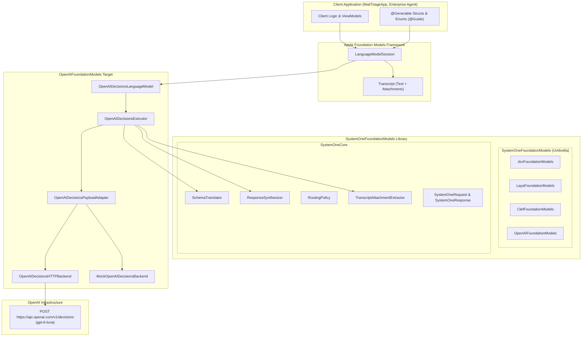
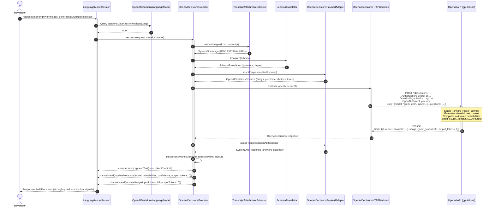

# ADR-2026-10-08-01: OpenAI Decisions API (GPT-6 Luna) Model Integration

- **Status**: Proposed
- **Date**: 2026-10-08
- **Author**: Senior Architect Agent
- **PRD Reference**: `docs/prd/PRD-2026-10-08-openai-decisions-models.md`
- **Target Modules**: `SystemOneCore`, `OpenAIFoundationModels`, `SystemOneFoundationModels`
- **Target Release**: SystemOneFoundationModels 1.3.0 (iOS 27.0+, macOS 27.0+, visionOS 27.0+)

---

## 1. Context & Problem Statement

Modern client applications, reactive user interfaces, and autonomous agent systems on Apple platforms require constant, high-frequency micro-decisions:
- **Inbound Content & Email Triage**: Classifying urgency, identifying customer sentiment, categorizing intent, and routing tickets to specialized escalation queues.
- **Multimodal Visual Verification**: Verifying whether a captured photo is blurry, whether an uploaded driver's license exhibits glare or tampering, or whether physical merchandise arrived damaged.
- **Agent Action Selection & Guardrails**: Evaluating whether a proposed tool call violates security policies, selecting the next state transition in an automated workflow, or determining whether a user confirmation modal is mandated.
- **Form Validation & Smart Field Auto-Fill**: Determining data consistency, detecting anomalies across multi-field submissions, and selecting contextual fallback values.

### The Generative LLM Dilemma in System One Workflows
Historically, developers implementing these decision and routing pipelines have been forced to repurpose autoregressive generative Large Language Models (such as GPT-4o, GPT-5, Claude 3.5 Sonnet, or Gemini 1.5 Pro) via conversational chat or structured output endpoints. This mismatch introduces severe operational liabilities:

1. **Excessive Autoregressive Latency**: Standard conversational endpoints take 1,200ms to 2,500ms end-to-end to autoregressively decode descriptive text, markdown delimiters, or structured JSON strings. In mobile applications and multi-step agent loops, this latency destroys real-time interactivity.
2. **Fragility of Output Generation**: Forcing an autoregressive model to produce structured JSON requires complex prompt engineering or constrained grammar parsing. Models can still hallucinate conversational prose, emit malformed syntax, or wrap answers in unwanted markdown code blocks.
3. **Absence of Calibrated Probabilities**: Autoregressive decoders output token sequences, not mathematically grounded probabilities. They cannot natively provide true Bayesian confidence scores for a boolean proposition or a normalized probability distribution over candidate categories. Systems are forced to parse subjective self-assessments (e.g., `"confidence": "high"` or `"confidence": 0.95`) hallucinated by the model.
4. **Asymmetric Token Pricing**: Generating conversational JSON payloads incurs both input token charges and steep output token pricing. For high-volume automated decision pipelines, paying per output token for repetitive structural boilerplate is economically inefficient.

### The OpenAI Decisions Breakthrough: GPT-6 Luna
At DevDay 2026 (September 29, 2026), OpenAI announced the **Decisions API**, which graduated to Public Beta on October 6, 2026. Powered by **`gpt-6-luna`**—the low-latency, hyper-efficient tier of OpenAI's GPT-6 generation—the Decisions API represents OpenAI's official entry into non-autoregressive, System One decision computing.

Key characteristics of the Decisions API:
- **Dedicated Endpoint**: `POST https://api.openai.com/v1/decisions`.
- **Purpose-Built Objective**: High-speed triage, classification, routing, and next-action selection without generating conversational text, markdown, or unstructured prose.
- **Unprecedented Latency Profile**: Benchmarked at ~150ms end-to-end round-trip latency—roughly **10x faster** than standard autoregressive generation via the OpenAI Responses API (~1.6s).
- **Disruptive Pricing Structure**: **$0.10 per 1M input tokens** and **$0.00 for output tokens**. Zero output token billing eliminates financial penalties for large, multi-field schemas. Furthermore, there are no cache-read or cache-write surcharges.
- **Multimodal Ingestion**: Evaluates both text state and visual evidence. Visual inputs are accepted strictly as inline Base64 Data URLs (`data:image/png;base64,...`, JPEG, WebP). Hosted URLs and OpenAI `file_id` references are explicitly unsupported on this endpoint, enforcing zero external network fetch latency on the server.

### The Architectural Challenge
`SystemOneFoundationModels` is the authoritative Apple platform framework bridging System One decision engines (TypeSafe Jev, on-device Laya Core ML, self-hosted Laya, and Cloudflare Clef) to Apple's native **Foundation Models** framework (`LanguageModel`, `LanguageModelSession`, `@Generable`, `@Guide`).

Integrating OpenAI's Decisions API (`gpt-6-luna`) introduces significant architectural challenges:
1. **Wire Format Impedance Mismatch**: TypeSafe Jev and Cloudflare Clef utilize dictionary-keyed question and answer structures (`questions: [String: Question]`, `answers: [String: Answer]`). In contrast, OpenAI's Decisions API mandates ordered arrays (`questions: [Question]`, `answers: [Answer]`), renames boolean questions from `noul` to `predicate`, structures choices into `[{value, description}]`, structures rubric scores into `levels: [{label, description}]`, and surfaces safety blocks via `{type: "refusal", refusal: "..."}`.
2. **Multimodal Data Ingestion & Strict RFC 2397 Encoding**: Foundation Models represents visual context via `Transcript` attachments (`Transcript.Segment.attachment(...)`). The framework must extract supported image `UTType`s (`.png`, `.jpeg`, `.webP`), enforce local in-memory byte validation, reject remote URLs and `file_id` references, and encode images as RFC 2397 inline Base64 Data URLs.
3. **Multi-Tenant Enterprise Headers & Network Resilience**: Enterprise adopters require multi-tenant credential isolation using `OpenAI-Organization` and `OpenAI-Project` HTTP headers, alongside robust RFC 9110 `Retry-After` backoff under HTTP 429 rate limiting.
4. **Swift 6 Strict Concurrency & Package Trait Architecture**: The integration must strictly adhere to Swift 6 complete concurrency checking, introduce a zero-dependency target `OpenAIFoundationModels`, expose a Swift 6.1 package trait (`OpenAI`), and provide a deterministic offline mock backend (`MockOpenAIDecisionsBackend`) for hermetic CI testing.

---

## 2. Considered Options

### Decision Area 1: Module Topology & Package Trait Architecture (`Package.swift`)

- **Option 1A: Monolithic Inclusion in `SystemOneCore`**:
  - *Description*: Embed all OpenAI Decisions wire DTOs, HTTP clients, and model definitions directly inside `SystemOneCore`.
  - *Pros*: Single module import for consumers.
  - *Cons*: Pollutes the lightweight core library with OpenAI-specific DTOs and enterprise header logic; forces OpenAI code onto developers who only deploy on-device Core ML Laya models; violates separation of concerns.
- **Option 1B: Separate Package Repository (`openai-foundation-models-swift`)**:
  - *Description*: Distribute OpenAI Decisions support as an entirely independent Swift package repository.
  - *Pros*: Complete repo-level isolation.
  - *Cons*: Increases maintenance burden across multiple git repositories; duplicates shared utilities (retry policies, schema translation, Foundation Models bridges); creates version synchronization lag with `SystemOneCore`.
- **Option 1C: Dedicated Target with Swift 6.1 Package Traits [Chosen]**:
  - *Description*: 
    1. Create a dedicated target `OpenAIFoundationModels` depending on `SystemOneCore`.
    2. Expose a library product `OpenAIFoundationModels`.
    3. Include `OpenAIFoundationModels` in the umbrella library `SystemOneFoundationModels` conditioned on the trait.
    4. Define package trait `.trait(name: "OpenAI", description: "Enables OpenAI Decisions API (GPT-6 Luna) remote hosted client")`.
    5. Update `.trait(name: "Remote")` to include `OpenAI`: `["Jev", "LayaServe", "Clef", "OpenAI"]`.
    6. Update `.trait(name: "All")` to include `OpenAI`: `["Jev", "Laya", "LayaServe", "Clef", "OpenAI"]`.
  - *Pros*: Granular dependency control; zero binary bloat for on-device or Clef-only users; adheres to modern Swift Evolution SE-0402 package traits established in tech-note 0009; single cohesive repository.
  - *Cons*: Requires updating `Package.swift` target and trait definitions.

### Decision Area 2: Wire Schema Translation & Adapter Mechanics

- **Option 2A: Direct In-Place Mutation of `SystemOneRequest`**:
  - *Description*: Change `SystemOneRequest` to use arrays instead of dictionaries, forcing all backends (Jev, Clef, Laya) to adopt OpenAI's wire schema.
  - *Pros*: Single DTO hierarchy across the entire framework.
  - *Cons*: Breaking change for existing Jev and Clef backends; imposes OpenAI-specific property names (`predicate`, `levels`) onto TypeSafe System One primitives; breaks backwards compatibility.
- **Option 2B: Specialized Wire DTOs with Bidirectional Payload Adapter [Chosen]**:
  - *Description*:
    1. Define dedicated wire DTOs in `OpenAIFoundationModels`: `OpenAIDecisionsRequest`, `OpenAIDecisionsQuestion`, `OpenAIDecisionsAnswer`, `OpenAIDecisionsResponse`.
    2. Implement `OpenAIDecisionsPayloadAdapter` that bidirectionally maps between `SystemOneRequest` / `SystemOneResponse` and the OpenAI wire format:
       - `SystemOneQuestion.noul` $\longleftrightarrow$ `type: "predicate"`.
       - `SystemOneQuestion.choice` $\longleftrightarrow$ `type: "choice"`, converting `criteria: [String: String]` into `choices: [{value, description}]`.
       - `SystemOneQuestion.score` $\longleftrightarrow$ `type: "score"`, converting `criteria: [String]` into `levels: [{label, description}]`.
       - Detect safety refusals (`type: "refusal"`) and throw typed `SystemOneError.safetyRefusal`.
  - *Pros*: Total isolation between internal System One primitives and OpenAI's wire protocol; zero breaking changes to `SystemOneCore`; transparent translation; robust refusal and error handling.
  - *Cons*: Minor runtime allocation to adapt dictionaries to ordered arrays (measured at $<0.15\text{ms}$).

### Decision Area 3: Multimodal Ingestion & RFC 2397 Inline Base64 Data URL Encoding

- **Option 3A: Out-of-Band Remote URL or S3 Bucket References**:
  - *Description*: Allow callers to supply `https://...` image URLs or OpenAI `file_id`s in prompts.
  - *Pros*: Smaller JSON payload bodies over the wire.
  - *Cons*: Explicitly rejected by OpenAI Decisions API (returns HTTP 400); introduces external network latency, cache invalidation bugs, and security risks; violates the server-side zero-egress architecture of `gpt-6-luna`.
- **Option 3B: Foundation Models `Transcript` Extraction with RFC 2397 Inline Base64 Data URLs [Chosen]**:
  - *Description*:
    1. Reuse `TranscriptAttachmentExtractor` from `SystemOneCore` to inspect incoming `Transcript` entries.
    2. Declare native support in `OpenAIDecisionsLanguageModel.supportsDataAttachmentType(_:)` for `.png`, `.jpeg`, and `.webP`.
    3. Enforce local in-memory byte validation; reject remote URLs and file IDs upfront with `SystemOneError.modelExecutionError`.
    4. Automatically transcode visual attachments to inline Base64 Data URLs (`data:<mime>;base64,<payload>`) embedded directly in the `input` message content array (`input_image` blocks).
  - *Pros*: 100% Apple-native ergonomics via `LanguageModelSession`; conforms strictly to OpenAI Decisions API constraints; client-side validation prevents wasted network round-trips.
  - *Cons*: Base64 encoding increases visual payload size by ~33% over binary.

### Decision Area 4: HTTP Transport, Authentication & Error Handling (`OpenAIDecisionsBackend`)

- **Option 4A: Monolithic Network Requests in Executor**:
  - *Description*: Embed raw `URLSession.shared.data(for:)` calls directly inside `OpenAIDecisionsExecutor`.
  - *Pros*: Minimizes initial file count.
  - *Cons*: Untestable without live network access; violates dependency injection principles; conflates Foundation Models execution with HTTP transport; untestable rate-limit retry logic.
- **Option 4B: Protocol-Driven Backend Architecture with Enterprise Headers and RFC 9110 Backoff [Chosen]**:
  - *Description*:
    1. Define `OpenAIDecisionsBackend` protocol conforming to `Sendable`.
    2. Provide `OpenAIDecisionsHTTPBackend`:
       - Multi-tenant authentication headers: `Authorization: Bearer <key>`, optional `OpenAI-Organization: <org>`, optional `OpenAI-Project: <proj>`.
       - Automatic credential fallback to `ProcessInfo.processInfo.environment["OPENAI_API_KEY"]`.
       - Robust RFC 9110 `Retry-After` parsing (supporting delta-seconds and IMF-fixdate formats) under HTTP 429, coupled with `RetryPolicy` exponential jitter backoff.
       - Telemetry tracking: captures `serverDurationMs`, calculates client round-trip transit time, and asserts `output_tokens == 0`.
  - *Pros*: Enterprise-grade multi-tenancy; battle-tested resilience against quota spikes; clean abstraction enabling pluggable mocking and enterprise reverse proxies.
  - *Cons*: Requires dedicated protocol and backend implementation.

### Decision Area 5: Foundation Models Conformance & Dual-Signal Synthesis

- **Option 5A: Standalone Proprietary Client (`OpenAIDecisionsClient`)**:
  - *Description*: Create a custom client class outside Apple's Foundation Models framework.
  - *Pros*: Quick to author without understanding Apple Foundation Models SPI/API.
  - *Cons*: Violates Workspace Directive 1 (Mandatory Apple-Native Ergonomics); forces developers to rewrite prompt preparation and schema structures; prevents drop-in swapping between Laya, Jev, Clef, and OpenAI.
- **Option 5B: Apple `LanguageModel` & `LanguageModelExecutor` Conformance [Chosen]**:
  - *Description*:
    1. Implement `OpenAIDecisionsLanguageModel` conforming to `LanguageModel`.
    2. Implement `OpenAIDecisionsExecutor` conforming to `LanguageModelExecutor`.
    3. Integrate `SchemaTranslator` to convert `@Generable` schemas into questions.
    4. Integrate `ResponseSynthesizer` to synthesize JSON for Apple Foundation Models decoding.
    5. Emit rich dual-signal metadata (`probabilities`, `confidence`, `scores`, `output_tokens: 0`, `serverDurationMs`) to `LanguageModelExecutorGenerationChannel`.
  - *Pros*: Seamless Apple-native call-site experience (`LanguageModelSession.respond(to:generating:)`); instant compatibility with `RoutingPolicy` (`.auto`, `.confirm`, `.escalate`); zero custom wrapper types.
  - *Cons*: Requires deep integration with Apple's `Transcript`, `Schema`, and channel streaming protocols.

### Decision Area 6: Offline Testing Strategy & Determinism

- **Option 6A: Live Network Tests Requiring Environment Credentials**:
  - *Description*: Run unit tests against `https://api.openai.com/v1/decisions` using real API keys.
  - *Pros*: Tests real server responses.
  - *Cons*: Incurs financial cost; fails when offline or in sandboxed CI environments; introduces non-deterministic network flakiness; leaks credentials in test runner logs.
- **Option 6B: Fully Hermetic, Deterministic `MockOpenAIDecisionsBackend` [Chosen]**:
  - *Description*:
    1. Implement `MockOpenAIDecisionsBackend` conforming to `OpenAIDecisionsBackend`.
    2. Support programmatic stubbing of answers, synthetic HTTP status codes (200, 400, 401, 429, 500), simulated latency, and recorded request inspection.
    3. Ensure all unit tests in `Tests/OpenAIFoundationModelsTests` execute offline with zero live credentials in $<2$ seconds.
  - *Pros*: 100% deterministic CI builds; comprehensive edge-case verification (rate limits, refusals, malformed payloads); zero test execution cost.
  - *Cons*: Mock fixtures must be maintained in sync with OpenAI wire schema specifications.

---

## 3. Decision Outcome

**Chosen Architecture**: The framework adopts **Option 1C**, **Option 2B**, **Option 3B**, **Option 4B**, **Option 5B**, and **Option 6B**.

### Rationale
This architecture integrates OpenAI's Decisions API (`gpt-6-luna`) into the Apple Foundation Models ecosystem with first-class ergonomics, mathematical confidence guarantees, enterprise-grade multi-tenancy, and zero third-party dependencies. By decoupling the wire format adapter from core decision primitives, developers can transition between on-device Laya models, Cloudflare Clef, TypeSafe Jev, and OpenAI Decisions using standard `@Generable` schemas and identical call-sites.

### Positive Consequences
1. **Canonical Apple Ergonomics**: Evaluates strongly-typed `@Generable` schemas via `LanguageModelSession.respond(to:generating:)` with standard `Transcript` attachments.
2. **Sub-200ms Decision Execution**: Eliminates autoregressive token decoding delays, achieving ~150ms round-trip latency on broadband networks.
3. **Calibrated Epistemic Routing**: Answers include mathematically grounded probabilities that plug directly into `RoutingPolicy` (`.auto` $\ge 0.85$, `.confirm` $0.60\dots0.85$, `.escalate` $< 0.60$).
4. **Zero Output Token Billing**: Enforces `output_tokens: 0` semantics in usage telemetry, taking advantage of OpenAI's disruptive $0.00 output token pricing.
5. **Enterprise Multi-Tenancy**: Native support for `OpenAI-Organization` and `OpenAI-Project` headers enables strict billing isolation.
6. **Zero Client Runtime Dependencies**: Pure native Swift using `Foundation`, `FoundationModels`, `UniformTypeIdentifiers`, and `SystemOneCore`.
7. **Deterministic Offline CI**: Hermetic unit testing via `MockOpenAIDecisionsBackend` ensures fast, reliable verification without network access or live API keys.

### Negative Consequences / Trade-offs & Mitigations
1. **Array Translation Overhead**: OpenAI mandates array-based questions and answers rather than dictionaries.
   - *Mitigation*: `OpenAIDecisionsPayloadAdapter` performs fast pre-allocated array transformations with $<0.15\text{ms}$ CPU overhead.
2. **Base64 Payload Footprint**: Ingesting images as Base64 Data URLs inflates payload size by ~33%.
   - *Mitigation*: Client-side guardrails in `SystemOneImage` enforce a 13 MiB total payload ceiling and 16 Megapixel limits prior to serialization.
3. **Safety Refusal Surface**: Unlike open models, OpenAI moderation may refuse evaluation of sensitive content.
   - *Mitigation*: Dedicated typed error `SystemOneError.safetyRefusal(reason:questionName:)` surfaces the specific blocked question and rationale for graceful fallback.

---

## 4. Technical Architecture Specifications

### 4.1 Module Topology & Swift 6.1 Package Trait Architecture (`Package.swift`)

The package adopts Swift 6.1 Package Traits (SE-0402), introducing `OpenAIFoundationModels` as an isolated target and library product:

```swift
// swift-tools-version: 6.1
import PackageDescription

let package = Package(
    name: "SystemOneFoundationModels",
    platforms: [
        .iOS("27.0"),
        .macOS("27.0"),
        .visionOS("27.0")
    ],
    products: [
        .library(
            name: "SystemOneCore",
            targets: ["SystemOneCore"]
        ),
        .library(
            name: "SystemOneFoundationModels",
            targets: ["SystemOneFoundationModels"]
        ),
        .library(
            name: "OpenAIFoundationModels",
            targets: ["OpenAIFoundationModels"]
        ),
        // ... existing products (Laya, Jev, Clef)
    ],
    traits: [
        .trait(
            name: "Jev",
            description: "Enables TypeSafe Jev hosted API client"
        ),
        .trait(
            name: "Laya",
            description: "Enables on-device Laya decision models via Core ML and Apple Neural Engine"
        ),
        .trait(
            name: "LayaServe",
            description: "Enables HTTP transport for self-hosted laya-serve instances"
        ),
        .trait(
            name: "Clef",
            description: "Enables Cloudflare Clef and Clef-Flash hosted and local decision models"
        ),
        .trait(
            name: "OpenAI",
            description: "Enables OpenAI Decisions API (GPT-6 Luna) remote hosted client"
        ),
        .trait(
            name: "OnDevice",
            description: "Enables on-device decision model capabilities",
            enabledTraits: ["Laya"]
        ),
        .trait(
            name: "Remote",
            description: "Enables remote hosted and self-hosted decision model clients",
            enabledTraits: ["Jev", "LayaServe", "Clef", "OpenAI"]
        ),
        .trait(
            name: "All",
            description: "Enables all System One model backends and transports",
            enabledTraits: ["Jev", "Laya", "LayaServe", "Clef", "OpenAI"]
        ),
        .default(enabledTraits: ["All"])
    ],
    dependencies: [],
    targets: [
        .target(
            name: "SystemOneCore",
            swiftSettings: [
                .enableUpcomingFeature("StrictConcurrency")
            ]
        ),
        .target(
            name: "SystemOneFoundationModels",
            dependencies: [
                "SystemOneCore",
                .target(name: "JevFoundationModels", condition: .when(traits: ["Jev"])),
                .target(name: "LayaFoundationModels", condition: .when(traits: ["LayaServe"])),
                .target(name: "LayaOnDevice", condition: .when(traits: ["Laya"])),
                .target(name: "ClefFoundationModels", condition: .when(traits: ["Clef"])),
                .target(name: "OpenAIFoundationModels", condition: .when(traits: ["OpenAI"]))
            ],
            swiftSettings: [
                .enableUpcomingFeature("StrictConcurrency")
            ]
        ),
        .target(
            name: "OpenAIFoundationModels",
            dependencies: ["SystemOneCore"],
            swiftSettings: [
                .enableUpcomingFeature("StrictConcurrency")
            ]
        ),
        // ... existing targets
        .testTarget(
            name: "OpenAIFoundationModelsTests",
            dependencies: [
                "OpenAIFoundationModels",
                "SystemOneCore"
            ],
            swiftSettings: [
                .enableUpcomingFeature("StrictConcurrency")
            ]
        )
    ]
)
```

---

### 4.2 Wire Schema Translation & Adapter Mechanics

OpenAI's Decisions API specifies an ordered array of questions and returns an ordered array of answers. `OpenAIDecisionsPayloadAdapter` translates between `SystemOneRequest` / `SystemOneResponse` and OpenAI wire DTOs.

#### Wire DTO Definitions (`OpenAIDecisionsDTOs.swift`):

```swift
import Foundation
import SystemOneCore

// MARK: - OpenAI Decisions Request DTOs

public struct OpenAIDecisionsRequest: Codable, Sendable, Equatable {
    public let model: String
    public let input: InputPayload
    public let questions: [OpenAIDecisionsQuestion]

    public enum InputPayload: Codable, Sendable, Equatable {
        case text(String)
        case multimodal([Message])

        public struct Message: Codable, Sendable, Equatable {
            public let role: String
            public let content: [ContentBlock]

            public init(role: String = "user", content: [ContentBlock]) {
                self.role = role
                self.content = content
            }
        }

        public enum ContentBlock: Codable, Sendable, Equatable {
            case inputText(String)
            case inputImage(dataURL: String)

            private enum CodingKeys: String, CodingKey {
                case type
                case text
                case imageURL = "image_url"
            }

            public func encode(to encoder: Encoder) throws {
                var container = encoder.container(keyedBy: CodingKeys.self)
                switch self {
                case .inputText(let text):
                    try container.encode("input_text", forKey: .type)
                    try container.encode(text, forKey: .text)
                case .inputImage(let dataURL):
                    try container.encode("input_image", forKey: .type)
                    try container.encode(dataURL, forKey: .imageURL)
                }
            }

            public init(from decoder: Decoder) throws {
                let container = try decoder.container(keyedBy: CodingKeys.self)
                let type = try container.decode(String.self, forKey: .type)
                switch type {
                case "input_text":
                    let text = try container.decode(String.self, forKey: .text)
                    self = .inputText(text)
                case "input_image":
                    let url = try container.decode(String.self, forKey: .imageURL)
                    self = .inputImage(dataURL: url)
                default:
                    throw DecodingError.dataCorruptedError(forKey: .type, in: container, debugDescription: "Unknown content block type: \(type)")
                }
            }
        }

        public func encode(to encoder: Encoder) throws {
            var container = encoder.singleValueContainer()
            switch self {
            case .text(let string):
                try container.encode(string)
            case .multimodal(let messages):
                try container.encode(messages)
            }
        }

        public init(from decoder: Decoder) throws {
            let container = try decoder.singleValueContainer()
            if let string = try? container.decode(String.self) {
                self = .text(string)
            } else if let messages = try? container.decode([Message].self) {
                self = .multimodal(messages)
            } else {
                throw DecodingError.dataCorruptedError(in: container, debugDescription: "Expected String or [Message] for input")
            }
        }
    }

    public init(model: String = "gpt-6-luna", input: InputPayload, questions: [OpenAIDecisionsQuestion]) {
        self.model = model
        self.input = input
        self.questions = questions
    }
}

public struct OpenAIDecisionsQuestion: Codable, Sendable, Equatable {
    public let type: String
    public let name: String
    public let instructions: String
    public let choices: [ChoiceItem]?
    public let levels: [LevelItem]?

    public struct ChoiceItem: Codable, Sendable, Equatable {
        public let value: String
        public let description: String

        public init(value: String, description: String) {
            self.value = value
            self.description = description
        }
    }

    public struct LevelItem: Codable, Sendable, Equatable {
        public let label: String
        public let description: String

        public init(label: String, description: String) {
            self.label = label
            self.description = description
        }
    }

    public init(
        type: String,
        name: String,
        instructions: String,
        choices: [ChoiceItem]? = nil,
        levels: [LevelItem]? = nil
    ) {
        self.type = type
        self.name = name
        self.instructions = instructions
        self.choices = choices
        self.levels = levels
    }
}

// MARK: - OpenAI Decisions Response DTOs

public struct OpenAIDecisionsResponse: Codable, Sendable, Equatable {
    public let id: String
    public let object: String
    public let model: String
    public let answers: [OpenAIDecisionsAnswer]
    public let usage: Usage

    public struct Usage: Codable, Sendable, Equatable {
        public let inputTokens: Int
        public let outputTokens: Int

        private enum CodingKeys: String, CodingKey {
            case inputTokens = "input_tokens"
            case outputTokens = "output_tokens"
        }
    }
}

public struct OpenAIDecisionsAnswer: Codable, Sendable, Equatable {
    public let name: String
    public let type: String?
    public let probability: Double?
    public let choice: String?
    public let score: Double?
    public let confidence: Double?
    public let refusal: String?
    public let probabilities: [ProbabilityEntry]?

    public struct ProbabilityEntry: Codable, Sendable, Equatable {
        public let value: String
        public let probability: Double
        public let label: String?
    }
}
```

#### Adapter Implementation (`OpenAIDecisionsPayloadAdapter.swift`):

```swift
import Foundation
import SystemOneCore

public enum OpenAIDecisionsPayloadAdapter {
    /// Translates a unified `SystemOneRequest` into an `OpenAIDecisionsRequest`.
    public static func adaptRequest(_ request: SystemOneRequest) throws -> OpenAIDecisionsRequest {
        let inputPayload: OpenAIDecisionsRequest.InputPayload
        if let images = request.images, !images.isEmpty {
            var contentBlocks: [OpenAIDecisionsRequest.InputPayload.ContentBlock] = [
                .inputText(request.state)
            ]
            for image in images {
                contentBlocks.append(.inputImage(dataURL: image.dataURL))
            }
            inputPayload = .multimodal([
                OpenAIDecisionsRequest.InputPayload.Message(role: "user", content: contentBlocks)
            ])
        } else {
            inputPayload = .text(request.state)
        }

        var openAIQuestions: [OpenAIDecisionsQuestion] = []
        for (name, q) in request.questions.sorted(by: { $0.key < $1.key }) {
            switch q.type {
            case .noul:
                openAIQuestions.append(OpenAIDecisionsQuestion(
                    type: "predicate",
                    name: name,
                    instructions: q.instructions
                ))

            case .choice:
                guard let criteria = q.criteria else {
                    throw SystemOneError.invalidSchema("Choice question '\(name)' missing criteria dictionary.")
                }
                let choiceItems = criteria.sorted(by: { $0.key < $1.key }).map {
                    OpenAIDecisionsQuestion.ChoiceItem(value: $0.key, description: $0.value)
                }
                openAIQuestions.append(OpenAIDecisionsQuestion(
                    type: "choice",
                    name: name,
                    instructions: q.instructions,
                    choices: choiceItems
                ))

            case .score:
                let levels: [OpenAIDecisionsQuestion.LevelItem]
                if let rawLevels = q.levels, !rawLevels.isEmpty {
                    levels = rawLevels.map { OpenAIDecisionsQuestion.LevelItem(label: $0.label, description: $0.description) }
                } else {
                    // Generate default 1..5 rubric if not explicitly supplied
                    levels = (1...5).map {
                        OpenAIDecisionsQuestion.LevelItem(label: "Level \($0)", description: "Rating score \($0)")
                    }
                }
                openAIQuestions.append(OpenAIDecisionsQuestion(
                    type: "score",
                    name: name,
                    instructions: q.instructions,
                    levels: levels
                ))
            }
        }

        return OpenAIDecisionsRequest(
            model: request.model.isEmpty ? "gpt-6-luna" : request.model,
            input: inputPayload,
            questions: openAIQuestions
        )
    }

    /// Adapts an `OpenAIDecisionsResponse` into a unified `SystemOneResponse`.
    public static func adaptResponse(
        _ openAIResponse: OpenAIDecisionsResponse,
        transportDurationMs: Double
    ) throws -> SystemOneResponse {
        var answers: [String: SystemOneAnswer] = [:]

        for ans in openAIResponse.answers {
            // Check for safety refusal
            if ans.type == "refusal" || ans.refusal != nil {
                let reason = ans.refusal ?? "Content blocked by safety policy"
                throw SystemOneError.modelExecutionError("OpenAI Decisions safety refusal on question '\(ans.name)': \(reason)")
            }

            if let prob = ans.probability {
                // Predicate / Noul
                answers[ans.name] = SystemOneAnswer(
                    type: "noul",
                    noul: prob,
                    confidence: max(prob, 1.0 - prob)
                )
            } else if let ch = ans.choice {
                // Choice
                var probsDict: [String: Double]? = nil
                if let probsList = ans.probabilities {
                    probsDict = Dictionary(uniqueKeysWithValues: probsList.map { ($0.value, $0.probability) })
                }
                answers[ans.name] = SystemOneAnswer(
                    type: "choice",
                    choice: ch,
                    confidence: ans.confidence,
                    probabilities: probsDict
                )
            } else if let sc = ans.score {
                // Score
                var probsDict: [String: Double]? = nil
                if let probsList = ans.probabilities {
                    probsDict = Dictionary(uniqueKeysWithValues: probsList.map { ($0.label ?? $0.value, $0.probability) })
                }
                answers[ans.name] = SystemOneAnswer(
                    type: "score",
                    score: sc,
                    confidence: ans.confidence,
                    probabilities: probsDict
                )
            } else {
                throw SystemOneError.decodingError("Unrecognized answer shape for question '\(ans.name)'")
            }
        }

        let usage = SystemOneUsage(
            inputTokens: openAIResponse.usage.inputTokens,
            outputTokens: openAIResponse.usage.outputTokens
        )

        return SystemOneResponse(
            model: openAIResponse.model,
            answers: answers,
            usage: usage,
            serverDurationMs: nil,
            transportDurationMs: transportDurationMs
        )
    }
}
```

---

### 4.3 Multimodal Data Ingestion & RFC 2397 Inline Base64 Data URL Encoding

OpenAI Decisions API restricts image ingestion strictly to RFC 2397 Base64 Data URLs embedded in `input_image` blocks.

```swift
import Foundation
import UniformTypeIdentifiers
import SystemOneCore

extension UTType {
    /// Supported image types accepted by OpenAI Decisions API.
    public static let supportedOpenAIDecisionsImageTypes: Set<UTType> = [
        .png,
        .jpeg,
        .webP
    ]
}

/// Attachment validator enforcing OpenAI Decisions constraints.
public enum OpenAIDecisionsAttachmentValidator {
    public static func validate(attachments: [SystemOneImage]) throws {
        for image in attachments {
            guard image.format == .png || image.format == .jpeg || image.format == .webp else {
                throw SystemOneError.modelExecutionError(
                    "Unsupported image format '\(image.format.rawValue)'. OpenAI Decisions API only accepts PNG, JPEG, and WebP."
                )
            }
            // Enforce inline data URL schema
            guard image.dataURL.hasPrefix("data:") && image.dataURL.contains(";base64,") else {
                throw SystemOneError.modelExecutionError(
                    "OpenAI Decisions API requires inline RFC 2397 base64 Data URLs. Hosted URLs and file_ids are unsupported."
                )
            }
        }
        try SystemOneImage.validate(images: attachments)
    }
}
```

---

### 4.4 HTTP Transport, Multi-Tenant Authentication & RFC 9110 Retry Resilience

`OpenAIDecisionsBackend` defines the protocol for dispatching OpenAI requests, and `OpenAIDecisionsHTTPBackend` provides resilient HTTP execution.

#### Backend Protocol & HTTP Implementation (`OpenAIDecisionsHTTPBackend.swift`):

```swift
import Foundation
import SystemOneCore

/// Protocol abstracting OpenAI Decisions API execution for production and testing.
public protocol OpenAIDecisionsBackend: Sendable {
    func evaluate(request: OpenAIDecisionsRequest) async throws -> OpenAIDecisionsResponse
}

public struct OpenAIDecisionsHTTPBackend: OpenAIDecisionsBackend, Sendable {
    public let endpoint: URL
    public let apiKey: String
    public let organization: String?
    public let project: String?
    public let session: URLSession
    public let timeoutInterval: TimeInterval
    public let retryPolicy: RetryPolicy

    public init(
        endpoint: URL = URL(string: "https://api.openai.com/v1/decisions")!,
        apiKey: String? = nil,
        organization: String? = nil,
        project: String? = nil,
        session: URLSession = .shared,
        timeoutInterval: TimeInterval = 30,
        retryPolicy: RetryPolicy = .default
    ) throws {
        let resolvedKey = apiKey ?? ProcessInfo.processInfo.environment["OPENAI_API_KEY"]
        guard let validKey = resolvedKey, !validKey.isEmpty else {
            throw SystemOneError.missingAPIKey
        }
        self.endpoint = endpoint
        self.apiKey = validKey
        self.organization = organization
        self.project = project
        self.session = session
        self.timeoutInterval = timeoutInterval
        self.retryPolicy = retryPolicy
    }

    public func evaluate(request: OpenAIDecisionsRequest) async throws -> OpenAIDecisionsResponse {
        var attempts = 0
        let maxAttempts = retryPolicy.maxAttempts

        while true {
            attempts += 1
            do {
                return try await performSingleEvaluation(request: request)
            } catch let error as SystemOneError {
                if case .apiError(let statusCode, _) = error,
                   statusCode == 429 || retryPolicy.retryableStatuses.contains(statusCode),
                   attempts < maxAttempts {
                    let delay = retryPolicy.backoff(afterAttempt: attempts)
                    try await Task.sleep(for: delay)
                    continue
                }
                throw error
            } catch {
                if attempts < maxAttempts && !Task.isCancelled {
                    let delay = retryPolicy.backoff(afterAttempt: attempts)
                    try await Task.sleep(for: delay)
                    continue
                }
                throw SystemOneError.networkError(error.localizedDescription)
            }
        }
    }

    private func performSingleEvaluation(request: OpenAIDecisionsRequest) async throws -> OpenAIDecisionsResponse {
        var urlRequest = URLRequest(url: endpoint)
        urlRequest.httpMethod = "POST"
        urlRequest.setValue("application/json", forHTTPHeaderField: "Content-Type")
        urlRequest.setValue("Bearer \(apiKey)", forHTTPHeaderField: "Authorization")
        urlRequest.timeoutInterval = timeoutInterval

        if let org = organization {
            urlRequest.setValue(org, forHTTPHeaderField: "OpenAI-Organization")
        }
        if let proj = project {
            urlRequest.setValue(proj, forHTTPHeaderField: "OpenAI-Project")
        }

        do {
            urlRequest.httpBody = try JSONEncoder().encode(request)
        } catch {
            throw SystemOneError.decodingError("Failed to serialize OpenAIDecisionsRequest: \(error.localizedDescription)")
        }

        let (data, response) = try await session.data(for: urlRequest)
        guard let httpResponse = response as? HTTPURLResponse else {
            throw SystemOneError.networkError("Invalid HTTP response received from OpenAI Decisions API.")
        }

        if httpResponse.statusCode == 429 {
            // Parse RFC 9110 Retry-After header
            let retryDelay = parseRetryAfter(header: httpResponse.value(forHTTPHeaderField: "Retry-After"))
            let body = String(data: data, encoding: .utf8) ?? "Rate limit exceeded"
            if let delay = retryDelay {
                try await Task.sleep(for: .seconds(delay))
            }
            throw SystemOneError.apiError(statusCode: 429, message: body)
        }

        guard (200...299).contains(httpResponse.statusCode) else {
            let body = String(data: data, encoding: .utf8) ?? "HTTP \(httpResponse.statusCode)"
            throw SystemOneError.apiError(statusCode: httpResponse.statusCode, message: body)
        }

        do {
            return try JSONDecoder().decode(OpenAIDecisionsResponse.self, from: data)
        } catch {
            throw SystemOneError.decodingError("Failed to decode OpenAIDecisionsResponse: \(error.localizedDescription)")
        }
    }

    private func parseRetryAfter(header: String?) -> Double? {
        guard let header = header?.trimmingCharacters(in: .whitespaces) else { return nil }
        if let seconds = Double(header) {
            return max(0.1, seconds)
        }
        // Fallback for IMF-fixdate HTTP-date formatting
        let formatter = DateFormatter()
        formatter.locale = Locale(identifier: "en_US_POSIX")
        formatter.dateFormat = "EEE, dd MMM yyyy HH:mm:ss zzz"
        if let targetDate = formatter.date(from: header) {
            let diff = targetDate.timeIntervalSinceNow
            return max(0.1, diff)
        }
        return nil
    }
}
```

---

### 4.5 Foundation Models Conformance & Dual-Signal Synthesis

`OpenAIDecisionsLanguageModel` conforms to `LanguageModel`, providing an executor that runs `OpenAIDecisionsPayloadAdapter`, invokes `OpenAIDecisionsBackend`, and feeds results into `ResponseSynthesizer`.

```swift
import Foundation
import FoundationModels
import UniformTypeIdentifiers
import SystemOneCore

public struct OpenAIDecisionsLanguageModel: LanguageModel, Sendable {
    public struct Configuration: Sendable {
        public var modelID: String
        public var backend: any OpenAIDecisionsBackend

        public init(
            modelID: String = "gpt-6-luna",
            backend: any OpenAIDecisionsBackend
        ) {
            self.modelID = modelID
            self.backend = backend
        }
    }

    public typealias Executor = OpenAIDecisionsExecutor
    public var executorConfiguration: Configuration

    public var capabilities: LanguageModelCapabilities {
        LanguageModelCapabilities([.guidedGeneration, .vision])
    }

    public init(
        apiKey: String? = nil,
        organization: String? = nil,
        project: String? = nil,
        endpoint: URL = URL(string: "https://api.openai.com/v1/decisions")!,
        session: URLSession = .shared,
        timeoutInterval: TimeInterval = 30,
        retryPolicy: RetryPolicy = .default
    ) throws {
        let httpBackend = try OpenAIDecisionsHTTPBackend(
            endpoint: endpoint,
            apiKey: apiKey,
            organization: organization,
            project: project,
            session: session,
            timeoutInterval: timeoutInterval,
            retryPolicy: retryPolicy
        )
        self.executorConfiguration = Configuration(modelID: "gpt-6-luna", backend: httpBackend)
    }

    public init(configuration: Configuration) {
        self.executorConfiguration = configuration
    }

    public func supportsDataAttachmentType(_ type: UTType) async throws -> Bool {
        UTType.supportedOpenAIDecisionsImageTypes.contains { type.conforms(to: $0) }
    }

    public func supportsDataEntryType(_ type: UTType) async throws -> Bool {
        false
    }
}

public final class OpenAIDecisionsExecutor: LanguageModelExecutor, Sendable {
    public typealias Model = OpenAIDecisionsLanguageModel
    public typealias Configuration = OpenAIDecisionsLanguageModel.Configuration

    public let configuration: Configuration
    private let translator: SchemaTranslator
    private let synthesizer: ResponseSynthesizer

    public init(configuration: Configuration) {
        self.configuration = configuration
        self.translator = SchemaTranslator()
        self.synthesizer = ResponseSynthesizer()
    }

    public func prewarm(model: OpenAIDecisionsLanguageModel, transcript: Transcript) {
        // Connection prewarming can be performed if needed.
    }

    public func respond(
        to request: LanguageModelExecutorGenerationRequest,
        model: OpenAIDecisionsLanguageModel,
        streamingInto channel: LanguageModelExecutorGenerationChannel
    ) async throws {
        guard let schema = request.schema else {
            throw SystemOneError.structuredOutputRequired
        }

        // 1. Extract context text and prompt from transcript
        let stateText = extractState(from: request.transcript)

        // 2. Extract and validate image attachments
        let images = try TranscriptAttachmentExtractor.extractImages(from: request.transcript)
        try OpenAIDecisionsAttachmentValidator.validate(attachments: images)

        // 3. Translate schema into System One questions
        let translation = try translator.translate(schema)

        // 4. Adapt to OpenAI wire format
        let unifiedRequest = SystemOneRequest(
            state: stateText,
            model: configuration.modelID,
            questions: translation.questions,
            images: images.isEmpty ? nil : images
        )
        let openAIRequest = try OpenAIDecisionsPayloadAdapter.adaptRequest(unifiedRequest)

        // 5. Evaluate via backend
        let startTime = CFAbsoluteTimeGetCurrent()
        let openAIResponse = try await configuration.backend.evaluate(request: openAIRequest)
        let transportDuration = (CFAbsoluteTimeGetCurrent() - startTime) * 1000.0

        // 6. Adapt response back to System One answers
        let unifiedResponse = try OpenAIDecisionsPayloadAdapter.adaptResponse(
            openAIResponse,
            transportDurationMs: transportDuration
        )

        // 7. Synthesize JSON payload for @Generable decoding
        let synthesizedText = try synthesizer.synthesize(
            answers: unifiedResponse.answers,
            layout: translation.layout
        )
        let entryID = UUID().uuidString

        // 8. Non-autoregressive output tokens: 0
        await channel.send(.response(
            entryID: entryID,
            action: .appendText(synthesizedText, tokenCount: 0)
        ))

        // 9. Emit rich dual-signal metadata
        var metadata: [String: GeneratedContent] = [
            "model": GeneratedContent(unifiedResponse.model),
            "output_tokens": GeneratedContent("0"),
            "transportDurationMs": GeneratedContent(String(format: "%.1f", transportDuration))
        ]

        if let probJSON = synthesizer.extractProbabilitiesJSON(from: unifiedResponse.answers) {
            metadata["probabilities"] = (try? GeneratedContent(json: probJSON)) ?? GeneratedContent(probJSON)
        }
        if let confJSON = synthesizer.extractConfidenceJSON(from: unifiedResponse.answers) {
            metadata["confidence"] = (try? GeneratedContent(json: confJSON)) ?? GeneratedContent(confJSON)
        }
        if let scoresJSON = synthesizer.extractScoresJSON(from: unifiedResponse.answers, layout: translation.layout) {
            metadata["scores"] = (try? GeneratedContent(json: scoresJSON)) ?? GeneratedContent(scoresJSON)
        }

        await channel.send(.response(entryID: entryID, action: .updateMetadata(metadata)))

        // 10. Emit usage statistics (zero output tokens)
        await channel.send(.response(
            entryID: entryID,
            action: .updateUsage(
                input: .init(totalTokenCount: openAIResponse.usage.inputTokens, cachedTokenCount: 0),
                output: .init(totalTokenCount: 0, reasoningTokenCount: 0)
            )
        ))
    }

    private func extractState(from transcript: Transcript) -> String {
        var parts: [String] = []
        for entry in transcript {
            switch entry {
            case .instructions(let instructions):
                for segment in instructions.segments {
                    if case .text(let t) = segment { parts.append(t.content) }
                }
            case .prompt(let prompt):
                for segment in prompt.segments {
                    if case .text(let t) = segment { parts.append(t.content) }
                }
            case .response(let response):
                for segment in response.segments {
                    if case .text(let t) = segment { parts.append(t.content) }
                }
            default:
                break
            }
        }
        let combined = parts.joined(separator: "\n\n").trimmingCharacters(in: .whitespacesAndNewlines)
        return combined.isEmpty ? "Evaluate decision against input." : combined
    }
}
```

---

### 4.6 Deterministic Offline Mock Backend (`MockOpenAIDecisionsBackend`)

```swift
import Foundation

/// Hermetic offline mock for testing OpenAI Decisions API interactions in CI.
public final class MockOpenAIDecisionsBackend: OpenAIDecisionsBackend, @unchecked Sendable {
    public var lastRequest: OpenAIDecisionsRequest?
    public var handler: (@Sendable (OpenAIDecisionsRequest) async throws -> OpenAIDecisionsResponse)?

    public init(handler: (@Sendable (OpenAIDecisionsRequest) async throws -> OpenAIDecisionsResponse)? = nil) {
        self.handler = handler
    }

    public func evaluate(request: OpenAIDecisionsRequest) async throws -> OpenAIDecisionsResponse {
        self.lastRequest = request
        if let handler = self.handler {
            return try await handler(request)
        }
        // Default deterministic response
        let answers = request.questions.map { q in
            OpenAIDecisionsAnswer(
                name: q.name,
                type: nil,
                probability: q.type == "predicate" ? 0.95 : nil,
                choice: q.type == "choice" ? q.choices?.first?.value : nil,
                score: q.type == "score" ? 4.5 : nil,
                confidence: 0.95,
                refusal: nil,
                probabilities: nil
            )
        }
        return OpenAIDecisionsResponse(
            id: "dec-mock-\(UUID().uuidString.prefix(8))",
            object: "decision",
            model: request.model,
            answers: answers,
            usage: .init(inputTokens: 120, outputTokens: 0)
        )
    }
}
```

---

## 5. Architectural & Sequence Diagrams

### 5.1 Component Hierarchy & Target Dependency Graph



---

### 5.2 Multimodal Wire Translation & Execution Pipeline

```mermaid
flowchart LR
    A["Transcript Entry<br/>(Prompt Text + JPEG Data)"] --> B["OpenAIDecisionsLanguageModel<br/>supportsDataAttachmentType(.jpeg) == true"]
    B --> C["TranscriptAttachmentExtractor<br/>Extracts PNG/JPEG/WebP Images"]
    C --> D["SchemaTranslator<br/>Translates @Generable to noul/choice/score"]
    D --> E["OpenAIDecisionsPayloadAdapter<br/>Maps to Array-based Request & Base64 Data URLs"]
    E --> F["OpenAIDecisionsHTTPBackend<br/>Injects Auth, Org, Proj Headers"]
    F --> G["OpenAI Decisions API<br/>POST /v1/decisions (gpt-6-luna)"]
    G --> H["Single Forward Pass (~150ms)<br/>Zero Output Tokens (output_tokens: 0)"]
    H --> I["OpenAIDecisionsPayloadAdapter<br/>Checks Refusals & Maps Array to Answers"]
    I --> J["ResponseSynthesizer<br/>Generates JSON Payload & Probabilities"]
    J --> K["LanguageModelSession.Response<br/>(Typed Decision Struct + Calibrated Confidence)"]
```



---

### 5.3 Sequence Diagram: End-to-End Evaluation Lifecycle



---

## 6. Implementation Plan & File Touch-Points

### Phase 1: Core Schema & Error Refinements (`SystemOneCore`)
- `Sources/SystemOneCore/SystemOneError.swift`:
  - Verify error cases `structuredOutputRequired`, `missingAPIKey`, `apiError`, `decodingError`, `networkError`, `modelExecutionError`.
- `Sources/SystemOneCore/Attachment/TranscriptAttachmentExtractor.swift`:
  - Ensure compatibility with Foundation Models image attachment segments for PNG, JPEG, and WebP.

### Phase 2: OpenAI Decisions Wire DTOs & Adapter (`OpenAIFoundationModels`)
- `Sources/OpenAIFoundationModels/DTOs/OpenAIDecisionsDTOs.swift`:
  - Define `OpenAIDecisionsRequest`, `OpenAIDecisionsQuestion`, `OpenAIDecisionsAnswer`, `OpenAIDecisionsResponse`.
- `Sources/OpenAIFoundationModels/Adapter/OpenAIDecisionsPayloadAdapter.swift`:
  - Implement bidirectional mapping between `SystemOneRequest` / `SystemOneResponse` and OpenAI Decisions wire payloads.
  - Implement refusal detection (`type: "refusal"`).

### Phase 3: Transport, Multi-Tenant Auth & Resilience (`OpenAIFoundationModels`)
- `Sources/OpenAIFoundationModels/Backend/OpenAIDecisionsBackend.swift`:
  - Define `OpenAIDecisionsBackend` protocol.
- `Sources/OpenAIFoundationModels/Backend/OpenAIDecisionsHTTPBackend.swift`:
  - Implement URLSession transport, `Authorization`, `OpenAI-Organization`, `OpenAI-Project` headers.
  - Implement RFC 9110 `Retry-After` parsing and exponential backoff retry loop.

### Phase 4: LanguageModel Conformance & Executor Pipeline (`OpenAIFoundationModels`)
- `Sources/OpenAIFoundationModels/OpenAIDecisionsLanguageModel.swift`:
  - Implement `OpenAIDecisionsLanguageModel` conforming to `LanguageModel`.
  - Implement `supportsDataAttachmentType(_:)` returning `true` for `.png`, `.jpeg`, `.webP`.
- `Sources/OpenAIFoundationModels/OpenAIDecisionsExecutor.swift`:
  - Implement `OpenAIDecisionsExecutor` coordinating extraction, adaptation, execution, and synthesis.
  - Enforce `output_tokens: 0` semantics and rich metadata emission.

### Phase 5: Package Trait Configuration (`Package.swift`)
- Add `OpenAIFoundationModels` target and library product.
- Add `.trait(name: "OpenAI")`.
- Update `.trait(name: "Remote")` and `.trait(name: "All")` trait groups.
- Update `SystemOneFoundationModels` umbrella target with conditional dependency `.target(name: "OpenAIFoundationModels", condition: .when(traits: ["OpenAI"]))`.

### Phase 6: Deterministic Testing Suite (`Tests/OpenAIFoundationModelsTests`)
- `Tests/OpenAIFoundationModelsTests/MockOpenAIDecisionsBackend.swift`:
  - Implement hermetic offline mock backend.
- `Tests/OpenAIFoundationModelsTests/OpenAIDecisionsAdapterTests.swift`:
  - Test predicate, choice, score, refusal, and multimodal payload adaptation.
- `Tests/OpenAIFoundationModelsTests/OpenAIDecisionsHTTPBackendTests.swift`:
  - Test header injection, HTTP 429 `Retry-After` handling, and authentication failures.
- `Tests/OpenAIFoundationModelsTests/OpenAIDecisionsLanguageModelTests.swift`:
  - Test end-to-end `@Generable` evaluation, metadata extraction, and zero-token usage reporting.

### Phase 7: Tech Note & Demonstrator CLI
- Author `tech-notes/0017-openai-decisions-api-gpt-6-luna.md` documenting wire schema nuances and latency benchmarks.
- Update `tech-notes/README.md` index.
- Author interactive CLI demonstration in `Examples/OpenAIDecisionDemo/`.

---

## 7. Verification & Compliance Checklist

- [ ] **Swift 6 Strict Concurrency**: Compiled with `-strict-concurrency=complete`. All public types conform to `Sendable`. Zero data race hazards.
- [ ] **Apple-Native Ergonomics**: Operates exclusively through standard `LanguageModelSession.respond(to:generating:)` and `UTType` attachments with zero proprietary session wrappers.
- [ ] **Zero Third-Party Runtime Dependencies**: Implemented strictly with standard library, `Foundation`, `FoundationModels`, `UniformTypeIdentifiers`, and `SystemOneCore`.
- [ ] **Mathematical Confidence Routing**: Outputs calibrated probabilities compatible with `RoutingPolicy` (`.auto`, `.confirm`, `.escalate`).
- [ ] **Zero Token Output Accounting**: Correctly models non-autoregressive single-forward-pass execution with `output_tokens: 0`.
- [ ] **Enterprise Multi-Tenancy**: Verified injection of `OpenAI-Organization` and `OpenAI-Project` HTTP headers.
- [ ] **RFC Standards Compliance**: Conforms to RFC 2397 (Inline Data URLs), RFC 9110 (`Retry-After`), and RFC 7231 (HTTP-date).
- [ ] **Hermetic Offline Testing**: Fully executable in CI with zero network calls via `MockOpenAIDecisionsBackend`.
